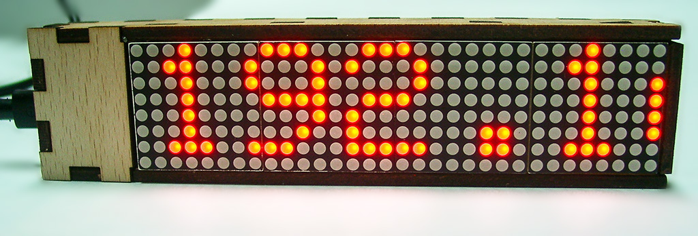
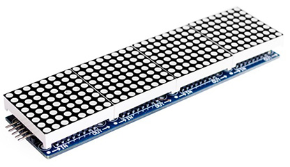

ESP-Matrix
===
___
ESP-Matrix ist ein Modul des Fablab Karlsruhe, das eine Reihe von LED-Matrix-Modulen als Laufschrift ansteuern kann.



Komponenten
-----------
Als Controller wird ein ESP8266 in Form eines WeMos D1 mini verwendet.

Die Matrixmodule bestehen aus 4 einfarbigen 8x8 LED Bausteinen, die von einem MAX7219 angesteuert werden.  Solche Modulreihen gibt es fertig konfektioniert für unter 4,-€.



Entworfen wurde das Ganze als Projekt für einen Kindergeburtstag, hat jedoch das Potential noch deutlich erweitert zu werden.
Denkbar ist einerseits die Kontrolle über verschiedene Funktionen des ESP nach Javascript weiterzureichen, so dass über Javascript-basierte Programmierung das Display gesteuert werden kann.  Dies wird dadaurch unterstützt, dass schon in dieser Version ein [vollständiger HTML-basierter Editor](https://ace.c9.io "ACE Editor") im ESP vorhanden ist, der seine Daten auf dem SPIFFS Dateisystem ablegen kann.

Weiterhin sind weitere vorgefertigte Funktionen im ESP denkbar, so dass neben freien Texten und Zeitinformationen auch andere Informationen aus dem Internet geholt und dargestellt werden können.

Um den Sketch zu kompilieren wird eine Arduino-IDE ab 1.8.1 benötigt, bei älteren IDEs muss die [ESP-Unterstützung von Github ](https://github.com/esp8266/Arduino "ESP8266/Arduino")installiert werden (nicht per Boardmanager-URL!), da ansonsten einige der Bibliotheken nicht kompiliert werden können. Die asynchronen Kommunikationsbibliotheken benötigen mindestens die Version 2.3 der ESP-Tools.

In beiden Fällen muss der Arduino-IDE noch der [ESP-Uploadmanager hinzugefügt werden](http://esp8266.github.io/Arduino/versions/2.3.0/doc/filesystem.html#uploading-files-to-file-system "Uploading files to SPIFFS"). Damit bekommt die IDE unter dem Werkzeuge Menupunkt eine weitere Option: **"ESP8266 Sketch Data Upload"**.

Bibliotheken
------------
Verwendung finden die folgenden Bibliotheken aus Github, die für das Projekt gepatcht wurden.  Diese Bibliotheken finden sich im Ordner "libraries" dieses Repositories:

- [**ESPAsyncWebServer.h**]( http://github.com/me-no-dev/ESPAsyncWebServer "Asynchroner Webserver")
- [**Timelib.h**]( http://github.com/PaulStoffregen/Time "Timelib")

Bei der Time-Bibliothek kommt es unter nicht case-sensitiven Systemen (Windows, Mac) oft zu Fehlermeldungen, wenn die Bibliothek als ***T**ime.h* eingebunden wird. Zahlreiche andere Bibliotheken bringen Headerdateien in der Schreibweise ***t**ime.h* mit.  Daher ist es sinnvoll diese Bibliothek in ein Verzeichnis *Time**lib*** zu installieren und auch die direkt die *Timelib.h* einzubinden.  Die im Projekt aus Rückwärtskompatibilitätsgründen enthaltene *Time.h* macht nichts anderes!

Neben den vorhandenen Arduino bzw. ESP-Standardbibliotheken werden folgende Bibliotheken aus Github-Repositories ohne Veränderung verwendet:

- [**ESPAsyncUDP.h**]( http://github.com/me-no-dev/ESPAsyncUDP "Asynchrones UDP")
- [**ESPAsyncTCP.h**]( http://github.com/me-no-dev/ESPAsyncTCP "Asynchrones TCP")
- [**Timezone.h**]( http://github.com/JChristensen/Timezone "Timezone")
- [**Max72xxPanel.h**]( https://github.com/markruys/arduino-Max72xxPanel.git "Max72xx Paneltreiber")

Folgende Bibliotheken, die per Arduino-Library-Manager installiert werden können werden verwendet:

- Adafruit_GFX.h

Grundidee bzw. weitere Entwicklung
---------------------------------------
Die Grundidee ist ein ständig laufender Webserver auf dem ESP, der sowohl für die Kommunikation mit der Applikation (hier der LED-Laufschrift) als auch für die Konfiguration des WLAN zuständig ist.  Der Schwachpunkt anderer Bibliotheken wie WiFi-Manager ist, dass sich dort der Webserver nach der WLAN-Konfiguration beendet. Zudem wurde Wert darauf gelegt, die asynchronen UDP und TCP Bibliotheken verwenden zu können, um weniger blockierende Kommunikation zu erhalten. 
Die im Paket *ESPAsyncWebServer* enthaltene Funktion des [ACE-Editors](https://ace.c9.io/ "ACE Javascript Editor") wurde soweit abgeändert, dass dieser vollständig im Speicher des ESP abgelegt werden kann, und auch im AP Mode zur Verfügung steht. Gleiches sollte für eine Adaption einer graphischen Programmiermöglichkeit dienen, die ESP-Funktionen nach Javascript druchreicht.  Hier ist [Tuniot](http://easycoding.tn/ "Tuniot") ggf. eine Möglichkeit, die aktuell getestet wird.

**Ansonsten steht noch aus:**
 - **Refactoring:** Zusammenfassen der Webserver- und Konfigurationsfunktionen in eine eigene Bibliothek und Klasse als Basis für beliebige web-basierte ESP-Anwendungen. Desweiteren Kapseln der Matrix- und Zeitfunktionen in ebenfalls 
 - Mehrstufige Benutzerauthentifizierung und -verwaltung (Trennen von Konfiguration und Anwendung)
 - Ausbau der IP-Konfiguration um WPS, feste IP-Adressen und Netzwerkkonfiguration, DHC-Range, etc..
 - Einsatz von https
 - Durchreichen der ESP-Funktionen zum Browser zum Einsatz browserbasierter Programmierung
 - OTA Updates

aktuell implementierte Funktionen
---------------------------------
Derzeit startet der ESP in den AP-Mode und ist über den im Sourcecode hinterlegten SSID-Namen **ESPMATRIX** und das Passwort **ABCdef123456** erreichbar.
Sollte der ESP bereits die Zugangsinformationen zu einem aktuell erreichbaren WLAN gespeichert haben (z.B. weil vorher ein anderer Sketch geladen war), so verbindet er sich dorthin!
Die LED-Matric zeigt in allen Fällen dann die IP-Adresse an, unter der der ESP zu erreichen ist. 
Sollte der ESP sich nicht programmieren lassen, oder sollte es Probleme beim Verbinden mit WLANs geben, so ist es ratsam, den ESP zunächst komplett zu löschen. Dies geschieht mit dem esptool.py:
```Shell
python path/to/esptool.py --port COMPORTNAME erase_flash
```
Dies kann auch bei neu gekauften Modulen notwendig sein, da diese manchmal mit inkompatiblem Aufbau der Speicherstrukturen zur Arduino IDE ausgelifert werden. Die Arduino-IDE schreibt nur in der ersten Speicherblock und geht dabei [von einem Standardlayout aus](http://esp8266.github.io/Arduino/versions/2.3.0/doc/filesystem.html#flash-layout "Flash Layout")!
Das ist eionerseits sinnvoll, weil so keine Inhalte der anderen Speicherbereiche angerührt werden, kann aber zu Problemen führen, wenn diese Bereich nicht so liegen bzw. gefüllt sind, wie dies die IDE oder der Sketch erwartet!
Sobald man mit dem ESP verbunden ist, gibt es diese wichtigen URLs:
- **/content**  Erlaubt Inhalt, Helliugkeit und Geschwindigkeit des Textes einzustellen. Uhrzeit und Datum sind derzeit nur dann aktuell, wenn der ESP sich als Client in einem WLAN befindet und einen NTP-Server erreicht (de.pool.ntp.org).
- **/wificonnectAP** Ermöglicht es dem ESP, sich als Client an ein vorhandenes WLAN zu verbinden.
- **/wificonfigAP** Erlaubt es, SSID und Passwort für den AP Mode, sowie das Passwort für den Administrationsaccount (voreingestellt admin/admin) zu ändern.
- **/wifiRestartAP** Löscht die gespeicherten WLAN Client-Zugangsdaten und startet im AP-Mode
- **/edit** Startet den eingebauten ACE Editor, um die auf dem SPIFFS abgelegten Dateien zu editieren.  Für den Editor is es nun unabdingbar, dass der Inhalt des data-Unterverzeichnisses mittels des oben beschriebenen [ESP-Uploadmanagers](http://esp8266.github.io/Arduino/versions/2.3.0/doc/filesystem.html#uploading-files-to-file-system "ESP-Uploadmanager") auf des SPIFFS geladen wird. Ansonsten werden die Javascriptdateien nicht gefunden!

Verdrahtung
-----------
Es ist wichtig, dem ESP einen möglichst großen Stützkondensator zur Seite zu stellen.  Je nach USB-Port kommt es sonst zu Fehlverhalten beim Programmieren.  Sollten mehr als 4 LED-Module in Reihe geschaltet werden, so ist dafür zu sorgen, dass die LED-Module eine vom Programmierport unabhängige Spannungsversorgung erhalten.
Ansonsten werden die folgenden PINs miteinander verbunden:

|Wemos D1 mini|LED-Matrix|
|-------------|----------|
| D5 (14/CLK) | CLK|
| D6 (12/MISO)| CS |
| D7 (13/MOSI)| DIN|


